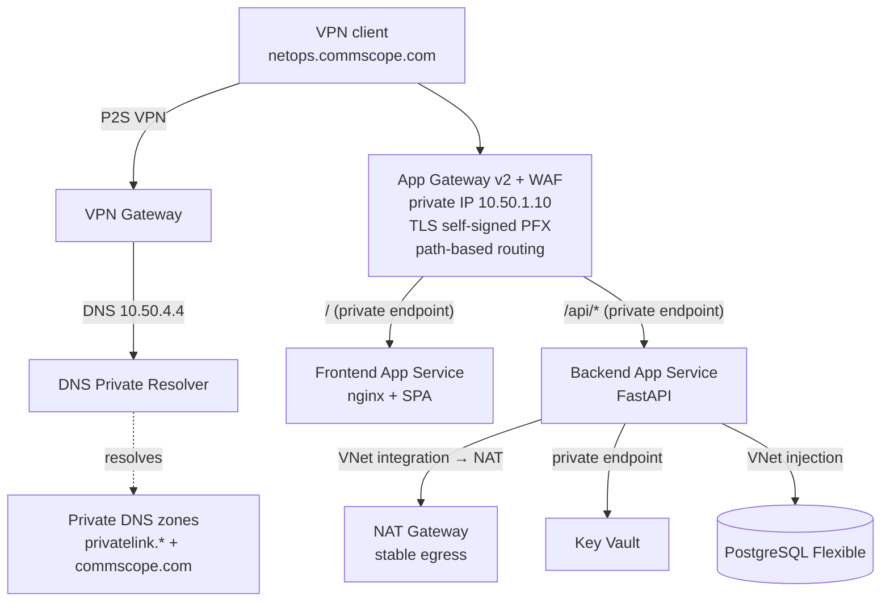

# NetOps Command Center — private architecture repro

A standalone, from-scratch reproduction of the **NetOps Command Center** target
architecture: a private-only web platform reachable only over VPN, fronted by an
internal Application Gateway (WAF + TLS), with the backend, database, and secrets
all on private endpoints.

This repro proves out the **single-origin login fix** and the **private
networking + DNS** design end-to-end. It intentionally **excludes** the AI
automation layer and the SSH-based vendor integration (separate phases).

## What gets deployed



- **VNet** `10.50.0.0/16` with dedicated subnets for App Gateway, App Service
  integration, private endpoints, DNS resolver, PostgreSQL, and the VPN gateway.
- **Two App Services** (Linux containers), each with a **private endpoint**
  (inbound) and **regional VNet integration** (outbound via **NAT Gateway**):
  - **Frontend** (nginx) serves the SPA at `/` — stand-in for the customer's
    Static Web App.
  - **Backend** (FastAPI) serves the API at `/api/*`, with managed identity; the
    DB password is injected directly (see the Key Vault note under *Notes & gotchas*).
  App Gateway **path-routes** both under one hostname, so the browser sees a
  **single origin** — which removes the CORS / Private-Network-Access login failure
  **without merging the two services**.
- **PostgreSQL Flexible Server**, VNet-injected (private).
- **Key Vault**, private endpoint — kept for topology fidelity. Note: this
  subscription's policy forces Key Vault public access **off**, so the repro does
  **not** write cert/secret data to it from the deployer (see *Notes & gotchas*).
- **Private DNS zones** for the PaaS private endpoints plus a `commscope.com`
  zone with `netops` → App Gateway private IP.
- **DNS Private Resolver** (inbound endpoint `10.50.4.4`) so VPN clients resolve
  the private zones.
- **Application Gateway v2 + WAF** with a **private** frontend IP, an HTTPS
  listener using a **self-signed PFX** (from `scripts/gen-tls-cert.ps1`), and a
  **URL path map** (`/` → frontend, `/api/*` → backend).
- **Point-to-Site VPN Gateway** (certificate auth, OpenVPN).

## Prerequisites

- Azure CLI (`az login`) with Owner/Contributor + User Access Administrator on the
  target subscription (role assignments are created).
- Terraform >= 1.6.
- Docker **not** required (image is built with `az acr build`).
- Windows PowerShell (for VPN cert generation via `New-SelfSignedCertificate`).

## Deploy

```powershell
cd netops-commscope-repro

# Provision everything (generates VPN + TLS certs, applies Terraform,
# builds/pushes both images, flips VNet DNS to the resolver).
# The PostgreSQL password is auto-generated unless you set TF_VAR_pg_admin_password.
./scripts/deploy.ps1 -SubscriptionId <your-sub-id>
```

> The **VPN Gateway takes ~30–45 minutes** to provision — that's the long pole.
> Everything else is up in a few minutes.

## Connect and test

1. Generate + install the VPN client profile:
   ```powershell
   $rg  = terraform -chdir=terraform output -raw resource_group
   $gw  = terraform -chdir=terraform output -raw vpn_gateway_name
   az network vnet-gateway vpn-client generate -g $rg -n $gw
   ```
   Download the returned URL, install with the **Azure VPN Client**, connect.
2. From the connected client, browse to the **custom_domain** output
   (e.g. `https://netops.commscope.com`). Accept the self-signed cert warning.
3. Log in with `netops` / `P@ssw0rd!`, then exercise:
   - **Devices** — protected API call
   - **Egress IP** — should return the **NAT Gateway** public IP (stable egress)
   - **DB check** — proves the private path to PostgreSQL

## Reproduce the *original* bug (optional)

To demonstrate the failure the customer hit, set the SPA's **API base URL** field
to the App Service's raw `*.azurewebsites.net` hostname (a different origin) — the
login call fails with the cross-origin / Private-Network-Access error. Clearing the
field (same origin behind App Gateway) makes it work.

## Teardown

```powershell
./scripts/destroy.ps1
```

## Notes & gotchas

- **Key Vault is policy-forced private** on this subscription (`publicNetworkAccess`
  can't be enabled). So the repro does **not** perform deployer→KV data-plane writes:
  the App Gateway TLS cert is a **local self-signed PFX** (`scripts/gen-tls-cert.ps1`)
  and the DB password is passed **directly**. The KV + private endpoint remain for
  topology fidelity. In production with proper network access, use a KV-managed cert
  and KV references.
- **VNet DNS flip**: in-VNet resources use Azure-default DNS during provisioning;
  `deploy.ps1` switches VNet DNS to the resolver (`10.50.4.4`) at the end so **VPN
  clients** inherit it. Reconnect the VPN after the flip if DNS doesn't update.
- **WAF** starts in **Detection** mode — switch the policy to Prevention once tuned.
- **App Gateway public IP** exists only because v2 requires one; **no listener uses
  it**, so there is no public entry point to the app.

### Deployment gotchas already handled in the code

These real Azure issues are baked into the Terraform so a fresh run is clean:

1. **VPN Gateway** — non-AZ `VpnGw1` SKU is retired → uses **`VpnGw1AZ`**, and its
   public IP has **zones** configured (required by the AZ SKU).
2. **Region** — some subscriptions are **offer-restricted for PostgreSQL** in certain
   regions (`LocationIsOfferRestricted`). This repro uses **`centralus`**.
3. **Key Vault** — policy-forced private (above).
4. **App Gateway SSL policy** — the default `AppGwSslPolicy20150501` is deprecated →
   pinned to **`AppGwSslPolicy20220101`**.
5. **Public IP `ip_tags`** — Azure injects `FirstPartyUsage` on Standard public IPs,
   which forces replacement → `lifecycle { ignore_changes = [ip_tags, zones] }`.
6. **`az acr build`** on Windows can emit a harmless `UnicodeEncodeError` while
   streaming logs — the image still builds (verify with `az acr repository show-tags`).
7. **DNS test** — `nslookup` **ignores NRPT**; the Azure VPN Client sets an NRPT rule
   to the resolver. Test with **`Resolve-DnsName`** (honors NRPT, like the browser).

## Handover docs

- [docs/ARCHITECTURE.md](docs/ARCHITECTURE.md) — detailed request flow, components, and
  why the CORS / Private-Network-Access login error happened + the fix.
- [docs/ADOPT-TERRAFORM-AZURE-DEVOPS.md](docs/ADOPT-TERRAFORM-AZURE-DEVOPS.md) —
  step-by-step guide to move an existing ClickOps environment onto Terraform with
  Azure DevOps CI/CD.
- [cicd/](cicd/) — ready-to-use pipeline (`azure-pipelines.yml`), backend example
  (`backend.tf.example`), and a remote-state bootstrap script
  (`bootstrap-remote-state.ps1`).
