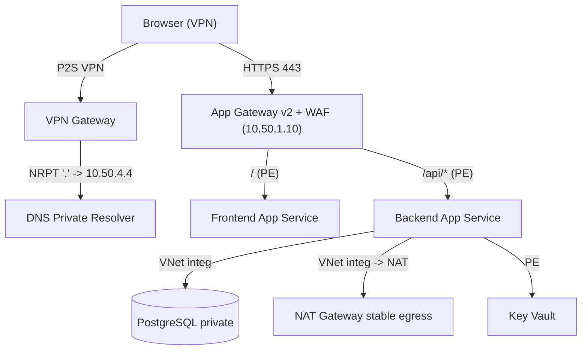

# NetOps Command Center — Architecture & Design

This document explains what the reference Terraform in this repo deploys, exactly
how a request flows through it, and **why the customer's login was failing** plus
the fix.

> Scope: private-only web platform (VPN-gated) with a single-origin App Gateway
> front door. Excludes the AI automation layer and SSH-based vendor integration.

## Components

| Layer | Resource | Purpose |
|---|---|---|
| Access | Point-to-Site **VPN Gateway** (`VpnGw1AZ`, OpenVPN, cert auth) | Only way into the VNet; no public app endpoints |
| DNS | **DNS Private Resolver** (inbound `10.50.4.4`) + Private DNS zones | Resolves `privatelink.*` and the custom domain over VPN |
| Edge | **Application Gateway v2 + WAF** (private frontend `10.50.1.10`, self-signed TLS) | Single-origin entry; path routing `/`→frontend, `/api/*`→backend |
| Frontend | **App Service** (nginx SPA) + private endpoint | Serves the SPA at `/` (stand-in for the Static Web App) |
| Backend | **App Service** (FastAPI) + private endpoint + VNet integration + managed identity | Serves the API at `/api/*` |
| Data | **PostgreSQL Flexible** (VNet-injected) | Private database |
| Secrets | **Key Vault** + private endpoint | Present for topology (policy-forced private on this sub) |
| Egress | **NAT Gateway** (stable public IP) | Predictable source IP for vendor allow-lists |
| Images | **ACR** + managed-identity pull | Container images for both App Services |

## Network / IP plan

- VNet `10.50.0.0/16`
- `snet-appgw` `10.50.1.0/24` (App Gateway private frontend `10.50.1.10`)
- `snet-app-integration` `10.50.2.0/24` (App Service VNet integration; NAT-associated)
- `snet-privateendpoints` `10.50.3.0/24`
- `snet-dnsr-inbound` `10.50.4.0/28` (resolver inbound `10.50.4.4`)
- `snet-postgres` `10.50.5.0/24` (delegated to PostgreSQL)
- `GatewaySubnet` `10.50.255.0/27`
- VPN client pool `172.16.100.0/24`

## Request flow (browser → login)

1. **VPN** — traffic enters the VNet via the P2S VPN Gateway (client-cert auth).
2. **DNS** — the Azure VPN Client's NRPT rule sends DNS to the **Resolver (`10.50.4.4`)**,
   which resolves the private `commscope.com` zone: `netops.commscope.com → 10.50.1.10`.
3. **App Gateway** — browser hits `10.50.1.10:443`; TLS terminates (self-signed cert),
   **WAF** inspects, then the **URL path map** routes `/` → frontend pool, `/api/*` → backend pool.
4. **Private endpoints** — App Gateway resolves each App Service FQDN via
   `privatelink.azurewebsites.net` to its **private endpoint IP** and routes over the VNet.
   The apps have `public_network_access_enabled = false`.
5. **Same origin = no CORS** — both tiers are served under one hostname, so the browser
   sees a **single origin**; `POST /api/v1/auth/login` succeeds with no CORS /
   Private-Network-Access error.
6. **Backend dependencies** — via VNet integration the backend reaches PostgreSQL and
   Key Vault privately, and the internet (vendor APIs) through the **NAT Gateway**.

## Why the CORS / origin error happened (and the fix)

**Root cause:** the customer's SPA (**Static Web App**) called the backend
(**App Service**) **directly** — two different hostnames = **two origins**. Because
both were **private** (resolving to `10.x`), the browser's **Private Network Access**
protection blocked the cross-origin call to a "local" address (the
*"Permission was denied … to access the 'local' address space"* console error), on
top of ordinary CORS. `Access-Control-Allow-Private-Network` is being deprecated, so
a CORS-header-only fix is not reliable.

**Fix:** make the frontend and API the **same origin**. Options:

1. **App Gateway single origin** (this repo): one hostname, path-routed
   `/` → frontend, `/api/*` → backend. Also delivers **WAF**, **custom domain + TLS**,
   and a front door that can consolidate multiple vendor backends.
2. **SWA linked-backend API proxy**: SWA proxies `/api` to the App Service under the
   SWA hostname → same origin. Simpler, but **no WAF** and no custom-domain-with-own-cert.

**What does not work:** the current two-origin (SWA → App Service) call.

## Key design decisions

- **Single origin via App Gateway** fixes login *and* satisfies WAF + custom
  domain/TLS + multi-backend consolidation.
- **Everything private**: private endpoints (App Services, Key Vault), VNet-injected
  PostgreSQL, private App Gateway frontend. Public IPs exist only where a resource
  requires one (App Gateway v2, NAT, VPN) and carry **no app listener**.
- **NAT Gateway** gives a **stable egress IP** for vendor allow-lists.
- **Self-contained cert/secret**: because this subscription's policy forces Key Vault
  private, the repo uses a **local self-signed PFX** for the listener and a **direct**
  DB password. In production with proper KV network access, switch to a KV-managed
  cert (auto-rotation) and KV references.

## Production hardening checklist

- Replace the **self-signed cert** with an **internal CA or public CA** cert (no
  browser warning); ideally a **Key Vault-managed cert** with auto-rotation.
- Move DB password back to a **Key Vault reference** once KV network access allows it.
- Switch **WAF** from Detection to **Prevention**.
- If using **Infoblox** for DNS: add **conditional forwarders** for the `privatelink.*`
  zones → the Resolver inbound endpoint, put the `netops.commscope.com` A record in
  Infoblox, and add a Resolver **outbound endpoint → Infoblox** for Azure→on-prem names.
- Consider **Azure Firewall** for FQDN-based egress control in front of the NAT path.
